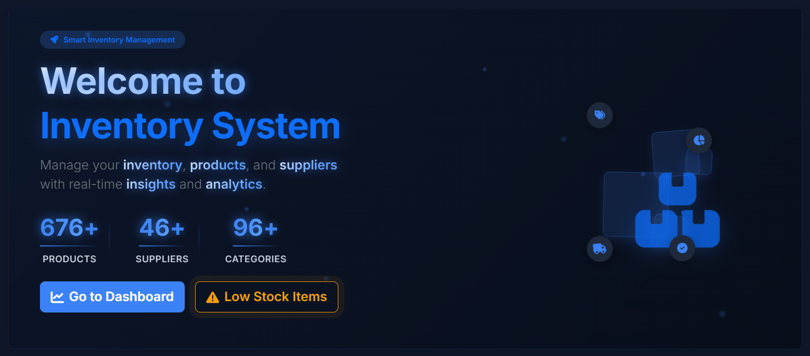

# 📦 Inventory Management System

<div align="center">


</div>

## 📌 Overview

The Inventory Management System (IMS) is a comprehensive web-based solution developed as a graduation project for the Digital Egypt Pioneers Initiative (DEPI). This system streamlines inventory management through real-time tracking, intelligent notifications, and detailed analytics.

<div align="center">

#### Frontend & UI
[](https://skillicons.dev)

#### Backend & Database
[](https://skillicons.dev)

#### Development Tools
[](https://skillicons.dev)

</div>

## 📋 Documentation

<div align="center">

| Document | Description | Status |
|:--------:|:------------|:------:|
| [📄 Project Overview](docs/ProjectOverview.md) | Business value & features |  |
| [📐 System Design](docs/SystemDesign.md) | Technical architecture |  |
| [🏗️ Project Structure](docs/ProjectStructure.md) | Code organization |  |
| [📝 Requirements](docs/ProjectRequirements.md) | Project requirements |  |

</div>

## ✨ Core Features

<div align="center">

<table>
<tr>
<td align="center"><h3>📦</h3></td>
<td><b>Product Management</b><br>Complete CRUD operations, hierarchical categorization, supplier relationships</td>
<td align="center"><h3>📊</h3></td>
<td><b>Reporting</b><br>Stock reports, analytics dashboard, export capabilities</td>
</tr>
<tr>
<td align="center"><h3>🔄</h3></td>
<td><b>Inventory Control</b><br>Real-time tracking, movement history, automated recording</td>
<td align="center"><h3>🔐</h3></td>
<td><b>Security</b><br>Role-based access, audit logging, data protection</td>
</tr>
<tr>
<td align="center"><h3>🔔</h3></td>
<td><b>Notification System</b><br>Low stock alerts, custom thresholds, user inbox</td>
<td align="center"><h3>📱</h3></td>
<td><b>Responsive UI</b><br>Mobile-friendly design, accessible interface</td>
</tr>
<tr>
<td align="center"><h3>🤝</h3></td>
<td><b>Supplier Management</b><br>Supplier directory, product associations, specific pricing</td>
<td align="center"><h3>📈</h3></td>
<td><b>Dashboard</b><br>KPIs, stock overview, activity tracking</td>
</tr>
</table>

</div>

## 💫 Interface Preview

<div align="center">



**[🎯 View all system screenshots](docs/ui-screenshots)**

</div>

## 🏗️ Repository Structure

```
📦 InventoryManagementSystem
 ┣ 📂 src                   # Source code of the application
 ┃ ┗ 📂 InventoryManagementSystem
 ┃   ┣ 📂 Controllers       # Request handlers
 ┃   ┣ 📂 Models            # Domain models
 ┃   ┣ 📂 Views             # UI templates
 ┃   ┣ 📂 Services          # Business logic
 ┃   ┣ 📂 Data              # Data access
 ┃   ┗ ... (other folders)
 ┣ 📂 docs                  # Project documentation
 ┗ 📜 README.md             # This file
```

For detailed information about the application structure, please refer to the [Project Structure](docs/ProjectStructure.md) documentation.

**Initiative**: Digital Egypt Pioneers Initiative (DEPI)<br>
**Track**: Full Stack .NET Developer | **Cohort**: 2024-2025<br>

## 🚀 Getting Started

### Prerequisites

- **.NET SDK**: .NET 8.0 SDK or later
- **Database**: SQL Server 2022 or later
- **IDE**: Visual Studio 2022 or Visual Studio Code

### Installation

1. Clone the repository
   ```bash
   git clone https://github.com/MohamedV0/inventory-system-depi.git
   ```

2. Navigate to the project directory
   ```bash
   cd inventory-system-depi/src/InventoryManagementSystem
   ```

3. Restore dependencies
   ```bash
   dotnet restore
   ```

4. Update the database connection string in `appsettings.json`

5. Apply migrations
   ```bash
   dotnet ef database update
   ```

6. Run the application
   ```bash
   dotnet run
   ```
