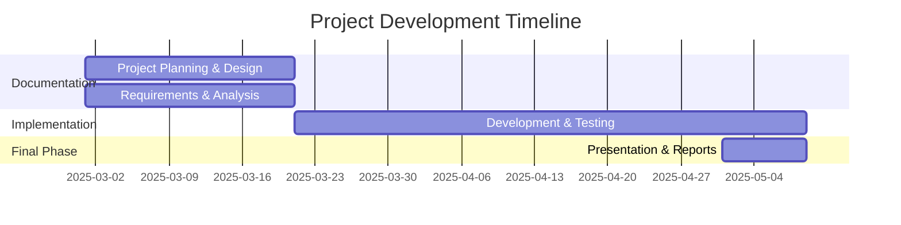

# 🏪 Inventory Management System

<div align="center">

[](https://depi.eg)
[](docs/ProjectOverview.md)
[](docs/)

[](docs/)
[](docs/SystemDesign.md)
[](docs/ImplementationGuide.md)

## 📋 Project Overview

The Inventory Management System (IMS) is a graduation project developed as part of the Digital Egypt Pioneers Initiative (DEPI). This comprehensive web-based solution is designed to revolutionize how businesses manage their inventory through real-time tracking, automated alerts, and intelligent analytics.

#### Frontend & UI
[](https://skillicons.dev)

#### Backend & Database
[](https://skillicons.dev)

#### Development Tools
[](https://skillicons.dev)

</div>

### 🎯 Core Features

- 📦 **Inventory Management**
  - Real-time stock tracking
  - Product categorization
  - Batch management
  
- 🔔 **Smart Alerts**
  - Low stock notifications
  - Reorder point automation
  - Custom alert thresholds
  
- 🤝 **Supplier Integration**
  - Order management
  - Communication portal
  - Performance tracking
  
- 📊 **Business Intelligence**
  - Custom reports
  - Analytics dashboard
  - Trend analysis
  
- 🔐 **Security & Access Control**
  - Role-based permissions
  - Audit logging
  - Data protection

## 📁 System Architecture

```
📦 InventoryManagementSystem
 ┣ 📂 src
 ┃ ┣ 📂 IMS.Web            # Presentation Layer
 ┃ ┣ 📂 IMS.Core           # Business Logic
 ┃ ┣ 📂 IMS.Infrastructure # Data Access
 ┃ ┗ 📂 IMS.Tests          # Testing Suite
 ┣ 📂 docs                 # Documentation
 ┗ 📂 sql                  # Database Scripts
```

## 📚 Project Documentation

<div align="center">

### Core Documentation
| Document | Purpose | Status | View |
|:--------:|:--------|:------:|:----:|
| [Project Overview](docs/ProjectOverview.md) | Project scope and planning |  | [](docs/ProjectOverview.md) |
| [System Design](docs/SystemDesign.md) | Technical architecture |  | [](docs/SystemDesign.md) |
| [Implementation Guide](docs/ImplementationGuide.md) | Development guide |  | [](docs/ImplementationGuide.md) |

### Documentation Progress
</div>

## 📅 Project Timeline

<div align="center">

### Development Phases

```mermaid
gantt
    title Project Development Timeline
    dateFormat  YYYY-MM-DD
    section Documentation
    Project Planning & Design    :2025-03-01, 2025-03-21
    Requirements & Analysis     :2025-03-01, 2025-03-21
    section Implementation
    Development & Testing      :2025-03-21, 2025-05-09
    section Final Phase
    Presentation & Reports    :2025-05-01, 2025-05-09
```

### Milestone Overview
| Phase | Deadline | Status | Deliverables |
|:------|:---------|:------:|:-------------|
| **Project Planning & Design** | March 21, 2025 |  | Project Plan, System Design, Requirements Doc |
| **Requirements & Analysis** | March 21, 2025 |  | Literature Review, Requirements Gathering |
| **Implementation & Testing** | May 9, 2025 |  | Source Code, Testing Reports |
| **Final Presentation** | May 9, 2025 |  | Final Documentation, Presentation |

</div>

## 👥 Development Team

<div align="center">

| Role | Member | Responsibilities | Scholar ID |
|:-----|:------:|:----------------|:--------:|
| **Full Stack Dev** | Mohamed Ashraf ElSayed | Backend & Frontend Development |  |
| **Full Stack Dev** | Lamis Ahmed Ebrahim | Backend & Frontend Development |  |
| **Full Stack Dev** | Shaimaa Abo Hashem Ibrahim | Backend & Frontend Development |  |

</div>

## 🎓 Program Details

- **Initiative**: Digital Egypt Pioneers Initiative (DEPI)
- **Track**: Full Stack .NET Developer
- **Cohort**: 2024-2025
- **Mentor**: Eng. Amira Hashim
- **Project Type**: Graduation Project

---

<div align="center">

*A Graduation Project for the Digital Egypt Pioneers Initiative (DEPI)*

</div>
