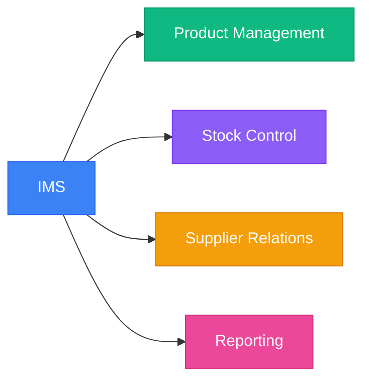
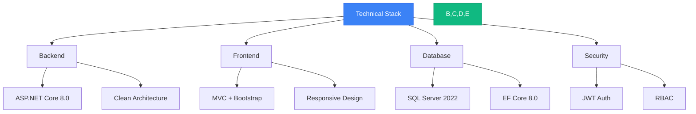
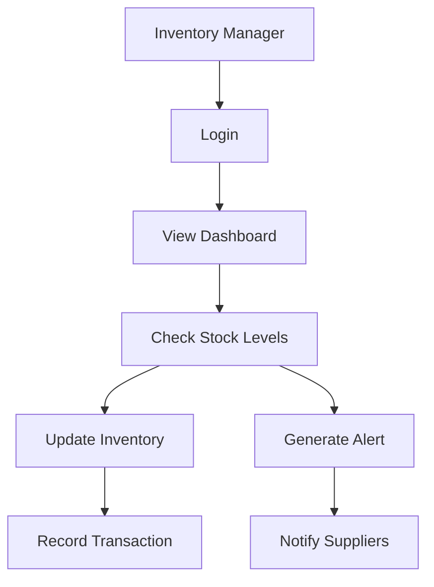
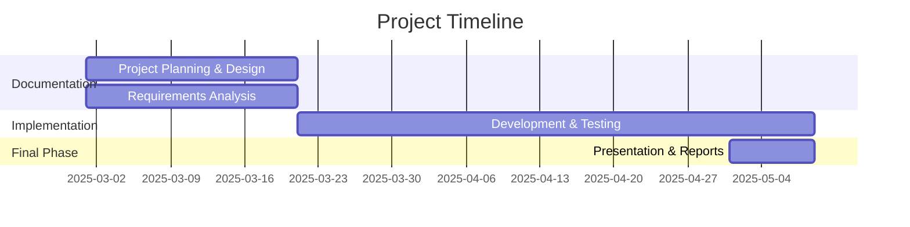

# 🏪 Inventory Management System

## 📋 Executive Summary

```mermaid
graph LR
    A[IMS] --> B[Product Management]
    A --> C[Stock Control]
    A --> D[Supplier Relations]
    A --> E[Reporting]
    
    style A fill:#3B82F6,stroke:#2563EB,color:white
    style B fill:#10B981,stroke:#059669,color:white
    style C fill:#8B5CF6,stroke:#7C3AED,color:white
    style D fill:#F59E0B,stroke:#D97706,color:white
    style E fill:#EC4899,stroke:#DB2777,color:white
```

### Project Overview
The Inventory Management System (IMS) is a comprehensive web-based solution built with ASP.NET Core, designed to revolutionize how businesses manage their inventory. This system enables real-time tracking of products, suppliers, and stock levels through a secure, role-based interface.

### Business Value
- 📈 Reduce operational costs through optimized inventory levels
- 🎯 Prevent stockouts and overstock situations
- 💡 Data-driven decision making through advanced analytics
- ⚡ Improved efficiency in inventory operations
- 🤝 Better supplier relationship management

### Key Features
- 📦 **Real-time Inventory Tracking**: Monitor stock levels instantly
- 🔔 **Smart Stock Alerts**: Automated notifications for low stock
- 🤝 **Supplier Management**: Streamlined supplier communications
- 📊 **Advanced Analytics**: Comprehensive reporting system
- 🔐 **Secure Role-based Access**: Granular access control

## 📚 Literature Review & Market Analysis

### Current Market Solutions
| Solution Type | Strengths | Limitations |
|:-------------|:----------|:------------|
| Legacy Systems | Proven reliability | Limited modern features |
| Cloud-based Solutions | Scalability | Higher costs |
| Open Source Tools | Cost-effective | Limited support |

### Industry Best Practices
- Real-time inventory tracking
- Automated reordering systems
- Mobile-first approach
- Integration capabilities
- Data-driven analytics

### Technology Trends
- Cloud-native architectures
- AI/ML for demand prediction
- IoT integration for tracking
- Blockchain for supply chain
- Progressive Web Apps (PWA)

## 📋 Project Evaluation

### Feedback & Assessment
| Aspect | Status | Notes |
|:-------|:-------|:------|
| Architecture |  | Clean Architecture approach |
| Code Quality |  | Following SOLID principles |
| Documentation |  | Comprehensive coverage |
| Testing |  | Unit & Integration tests |

### Areas for Enhancement
- Integration with external ERPs
- Mobile application development
- Advanced analytics dashboard
- Barcode/QR code scanning
- Multi-warehouse support

### Grading Criteria
| Component | Weight | Key Aspects |
|:----------|:------:|:------------|
| Documentation | 20% | Completeness, clarity |
| Implementation | 40% | Functionality, code quality |
| Testing | 20% | Coverage, scenarios |
| Presentation | 20% | Demo, explanation |

## 📦 Requirements Analysis

### Functional Requirements

| Category | Requirement | Priority | Status |
|:---------|:------------|:--------:|:------:|
| **Product Management** | CRUD operations, Categories |  |  |
| **Inventory Control** | Stock tracking, Adjustments |  |  |
| **Supplier Portal** | Order management, Communication |  |  |
| **Reporting** | Analytics, Exports |  |  |
| **Security** | Authentication, Authorization |  |  |

### Technical Requirements

```mermaid
graph TD
    A[Technical Stack] --> B[Backend]
    A --> C[Frontend]
    A --> D[Database]
    A --> E[Security]
    
    B --> B1[ASP.NET Core 8.0]
    B --> B2[Clean Architecture]
    C --> C1[MVC + Bootstrap]
    C --> C2[Responsive Design]
    D --> D1[SQL Server 2022]
    D --> D2[EF Core 8.0]
    E --> E1[JWT Auth]
    E --> E2[RBAC]

    style A fill:#3B82F6,stroke:#2563EB,color:white
    style B,C,D,E fill:#10B981,stroke:#059669,color:white
```

### Non-Functional Requirements

| Requirement | Target | Description |
|:------------|:------:|:------------|
| Performance | < 2s | Page load time |
| Scalability | 1000+ | Concurrent users |
| Availability | 99.9% | System uptime |
| Security | High | Data protection |

## 👥 Stakeholder Analysis

### User Stories

#### 🏢 Business Administrators
| Story | Priority | Acceptance Criteria |
|:------|:--------:|:-------------------|
| System Configuration |  | Complete control over system settings |
| User Management |  | Role assignment and access control |
| Business Analytics |  | Comprehensive reporting dashboard |

#### 👨‍💼 Inventory Managers
| Story | Priority | Acceptance Criteria |
|:------|:--------:|:-------------------|
| Stock Management |  | Real-time inventory updates |
| Alert System |  | Customizable notifications |
| Performance Reports |  | Detailed analytics views |

#### 🚚 Suppliers
| Story | Priority | Acceptance Criteria |
|:------|:--------:|:-------------------|
| Order Processing |  | Streamlined order workflow |
| Communication |  | Direct messaging system |
| Performance Tracking |  | Supplier metrics dashboard |

### Detailed Use Cases

```mermaid
graph TD
    A[Inventory Manager] --> B[Login]
    B --> C[View Dashboard]
    C --> D[Check Stock Levels]
    D --> E[Update Inventory]
    D --> F[Generate Alert]
    E --> G[Record Transaction]
    F --> H[Notify Suppliers]
```

#### Use Case: Stock Management
**Actor:** Inventory Manager
**Steps:**
1. Manager logs into system
2. Views current stock levels
3. Identifies items below threshold
4. Creates purchase order
5. Updates stock quantities
6. System records transaction

#### Use Case: Supplier Order
**Actor:** Supplier
**Steps:**
1. Supplier receives order notification
2. Logs into supplier portal
3. Reviews order details
4. Confirms order and delivery date
5. System updates order status

### Detailed User Stories

#### For Inventory Managers
- "As an inventory manager, I want to see low stock alerts so I can reorder items before they run out"
- "As an inventory manager, I want to generate reports so I can analyze inventory trends"
- "As an inventory manager, I want to adjust stock levels so I can correct discrepancies after physical counts"

#### For Administrators
- "As an admin, I want to manage user roles so I can control system access"
- "As an admin, I want to configure alert thresholds so I can optimize inventory levels"
- "As an admin, I want to view audit logs so I can track all system changes"

#### For Suppliers
- "As a supplier, I want to receive automated orders so I can process them quickly"
- "As a supplier, I want to update delivery status so customers know when to expect items"
- "As a supplier, I want to maintain my product catalog so customers see current offerings"

## 📅 Project Timeline & Milestones

```mermaid
gantt
    title Project Timeline
    dateFormat  YYYY-MM-DD
    section Documentation
    Project Planning & Design    :2025-03-01, 2025-03-21
    Requirements Analysis       :2025-03-01, 2025-03-21
    section Implementation
    Development & Testing      :2025-03-21, 2025-05-09
    section Final Phase
    Presentation & Reports    :2025-05-01, 2025-05-09
```

### System Performance Targets
| Metric | Target | Measurement |
|:-------|:------:|:-----------|
| System Uptime | 99.9% | Continuous monitoring |
| Response Time | < 2s | Per transaction |
| Database Query | < 500ms | Average query time |
| User Adoption | 80% | Within first month |
| Task Success | 95% | Completion rate |
| Support Response | < 24h | Ticket resolution |

### Key Milestones
| Milestone | Deliverable | Target Date |
|-----------|-------------|-------------|
| Project Planning | Project Plan, Requirements Doc | March 21, 2025 |
| System Design | Architecture & Database Design | March 21, 2025 |
| Implementation | Source Code & Testing | May 9, 2025 |
| Final Presentation | Documentation & Demo | May 9, 2025 |

### Resource Allocation
| Resource | Role | Time Allocation |
|----------|------|----------------|
| Mohamed Ashraf | Lead Developer | 40 hrs/week |
| Lamis Ahmed | Full Stack Dev | 35 hrs/week |
| Shaimaa Ibrahim | Full Stack Dev | 35 hrs/week |

## 📊 Key Performance Indicators (KPIs)

### System Performance
- System Uptime: Target 99.9%
- Response Time: < 2 seconds per transaction
- Database Query Time: < 500ms

### Business Metrics
- Stock Accuracy: 98% match with physical inventory
- Order Processing Time: < 5 minutes
- Low Stock Alert Response: < 24 hours

### User Engagement
- User Adoption Rate: 90% within first month
- Task Completion Rate: 95%
- Support Ticket Resolution: < 48 hours

## ⚠️ Risk Assessment

| Risk Category | Impact | Probability | Mitigation Strategy |
|:--------------|:------:|:-----------:|:-------------------|
| Data Loss |  |  | Regular backups, Audit trails |
| Performance |  |  | Optimization, Caching |
| Security |  |  | Security best practices |
| User Adoption |  |  | Training, Support |

## 👥 Team

| Role | Member | Responsibilities | Contact |
|:-----|:------:|:----------------|:--------:|
| **Full Stack Dev** | Mohamed Ashraf ElSayed | Backend & Frontend Development |  |
| **Full Stack Dev** | Lamis Ahmed Ebrahim | Backend & Frontend Development |  |
| **Full Stack Dev** | Shaimaa Abo Hashem Ibrahim | Backend & Frontend Development |  |

### Learning Objectives
- 🔧 Full-stack .NET development experience
- 💾 Database design and optimization
- 🔒 Security implementation
- 📚 Professional documentation
- 🏗️ Software architecture principles

---

*Building the future of inventory management*

