# 🏪 Inventory Management System

## 📋 Executive Summary

### Project Overview
The Inventory Management System (IMS) is a comprehensive web-based solution built with ASP.NET Core 8.0 MVC, designed to streamline inventory management for small to medium-sized businesses. The system enables real-time tracking of products, suppliers, and stock levels through a secure, role-based interface.

### Business Value
- 📈 Reduce operational costs through optimized inventory levels
- 🎯 Prevent stockouts and overstock situations
- 💡 Data-driven decision making through detailed reporting
- ⚡ Improved efficiency in inventory operations
- 🤝 Better supplier relationship management

### Key Features Implemented
- 📦 **Complete Product Management**: CRUD operations, categorization, supplier associations, SKU management
- 🔄 **Stock Movement Tracking**: Detailed history of all inventory changes with audit trails
- 🔔 **Low Stock Notifications**: Automated alerts when inventory falls below thresholds
- 🤝 **Supplier Management**: Comprehensive supplier information and product relationships
- 📊 **Reports & Analytics**: Stock reports, transaction history, and business insights with export options
- 🔐 **Secure User Authentication**: Role-based access control with ASP.NET Core Identity
- 📱 **Responsive UI**: Mobile-friendly design using Bootstrap 5
- 📝 **Activity Logging**: Comprehensive audit trails of system activities
- 🧾 **Multiple Export Formats**: Support for PDF, CSV, and Excel exports
- 🔍 **Advanced Search & Filtering**: Real-time search and filtering capabilities
- 🎚️ **Soft Deletion**: Data preservation through soft delete functionality

## 📚 Technology Stack

| Component | Technology | Purpose |
|:----------|:-----------|:--------|
| **Framework** | ASP.NET Core 8.0 MVC | Web application framework |
| **Database** | SQL Server 2022 | Data storage and management |
| **ORM** | Entity Framework Core 8.0 | Data access and migrations |
| **Frontend** | Bootstrap 5, jQuery | Responsive UI and interactions |
| **Authentication** | ASP.NET Core Identity 8.0 | User management and security |
| **Validation** | FluentValidation | Input validation and error handling |
| **Object Mapping** | AutoMapper | Entity to DTO/ViewModel mapping |
| **Reporting** | QuestPDF, CsvHelper, ClosedXML | Export and reporting capabilities |
| **API Documentation** | Swashbuckle/Swagger | API documentation |
| **Logging** | Serilog | Application logging |
| **Dependency Injection** | Scrutor | Advanced dependency registration |

## 📦 Feature Visualizations

### Product Management Interface

```mermaid
classDiagram
    class ProductListView {
        Header: "Product Management"
        SearchBar: "Search products..."
        ActionButton: "+ Add Product"
        Pagination: "1-10 of 53 items"
        RefreshButton: "↻"
    }
    
    class ProductTable {
        Headers: ["SKU", "Product", "Category", "Stock", "Status", "Actions"]
        SortableColumns: true
        FilterableColumns: true
        ResponsiveDesign: true
    }
    
    class ProductRow {
        SKU: "PRD-001"
        Name: "Wireless Keyboard"
        Description: "Bluetooth RGB"
        Category: "Electronics"
        Stock: 42
        Status: "In Stock"
        Actions: ["View", "Edit", "Delete"]
    }
    
    class ProductRow2 {
        SKU: "PRD-002"
        Name: "USB-C Hub Adapter"
        Description: "Multiport"
        Category: "Electronics"
        Stock: 8
        Status: "Low Stock"
        Actions: ["View", "Edit", "Delete"]
    }
    
    class ProductRow3 {
        SKU: "PRD-003"
        Name: "HD Webcam"
        Description: "1080p with Microphone"
        Category: "Accessories"
        Stock: 0
        Status: "Out of Stock"
        Actions: ["View", "Edit", "Delete"]
    }
    
    class StatusIndicator {
        InStock: "🟢"
        LowStock: "🟠"
        OutOfStock: "🔴"
        BackOrdered: "🔵"
    }
    
    ProductListView *-- ProductTable
    ProductTable *-- ProductRow
    ProductTable *-- ProductRow2
    ProductTable *-- ProductRow3
    ProductRow *-- StatusIndicator
    ProductRow2 *-- StatusIndicator
    ProductRow3 *-- StatusIndicator
```

### Stock Management Workflow

### Supplier-Product Relationship Model

### User Authentication & Management

### Reporting Architecture

## 👥 System Roles

### User Access Levels

| Role | Permissions | Access Areas |
|:-----|:------------|:-------------|
| **Administrator** | Full system access | All areas + User Management |
| **Manager** | Read/write most data | Products, Reports, Settings |
| **Staff** | Limited write access | Basic inventory operations |
| **Viewer** | Read-only access | Dashboards and Read-only views |

## 📦 Documentation Structure

The project is documented across multiple files, each with a specific focus:

- **ProjectOverview.md** (this file): High-level overview, business value, feature visualizations
- **[SystemDesign.md](SystemDesign.md)**: Technical architecture, database design, security implementation
- **[ProjectStructure.md](ProjectStructure.md)**: Code organization, component details, design patterns

## 🚀 Future Enhancements

### Planned Features
- Advanced reporting and business intelligence
- Mobile application for inventory management
- Barcode/QR code integration for stock tracking
- Supplier portal for order management
- Multi-warehouse/location support
- Integration with accounting systems
- API endpoints for third-party integration

## 🎓 Program Details

- **Initiative**: Digital Egypt Pioneers Initiative (DEPI)
- **Track**: Full Stack .NET Developer
- **Cohort**: 2024-2025
- **Mentor**: Eng. Amira Hashim
- **Project Type**: Graduation Project

---

*A Graduation Project for the Digital Egypt Pioneers Initiative (DEPI)*

