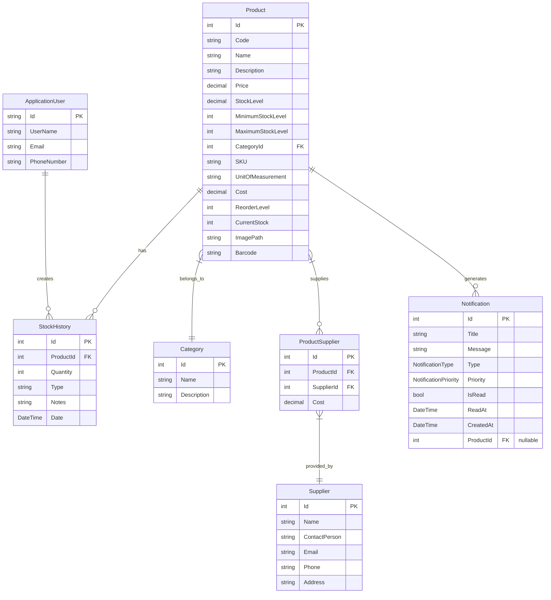

# 📁 Project Structure

This document outlines the current structure of the Inventory Management System project, reflecting the actual implementation.

> **Documentation Structure**  
> • [Project Overview](ProjectOverview.md): Business value, feature visualizations, team information  
> • [System Design](SystemDesign.md): Technical architecture, database design, security implementation  
> • **Project Structure** (this file): Code organization, component details, design patterns

## Directory Structure

```
📦 InventoryManagementSystem
 ┣ 📂 Areas                 # Identity and other feature areas
 ┣ 📂 Configuration         # Configuration classes for app settings
 ┣ 📂 Controllers           # MVC controllers handling HTTP requests
 ┣ 📂 Data                  # Data access layer
 ┃ ┣ 📂 Context            # Database context and unit of work
 ┃ ┣ 📂 Repositories       # Repository pattern implementations
 ┃ ┣ 📂 Configurations     # Entity configuration for EF Core
 ┃ ┗ 📂 Specifications     # Query specifications
 ┣ 📂 Extensions            # Extension methods
 ┣ 📂 Filters               # Action and exception filters
 ┣ 📂 Helpers               # Helper utilities
 ┣ 📂 Mappings              # AutoMapper profiles
 ┣ 📂 Middleware            # Custom middleware components
 ┣ 📂 Migrations            # EF Core database migrations
 ┣ 📂 Models                # Domain models
 ┃ ┣ 📂 Entities           # Database entities
 ┃ ┣ 📂 ViewModels         # View-specific models
 ┃ ┣ 📂 DTOs               # Data transfer objects
 ┃ ┣ 📂 Identity           # User identity models
 ┃ ┣ 📂 Validation         # Validation rules
 ┃ ┣ 📂 Common             # Common model classes and enums
 ┃ ┗ 📂 Exceptions         # Custom exceptions
 ┣ 📂 Services              # Business logic services
 ┃ ┗ 📂 Interfaces         # Service interfaces
 ┣ 📂 Views                 # Razor views
 ┣ 📂 wwwroot               # Static files (CSS, JS, images)
 ┣ 📜 Program.cs            # Application entry point and startup
 ┣ 📜 appsettings.json      # Application configuration
 ┗ 📜 InventoryManagementSystem.csproj # Project file
```

## Key Components

### Controllers
Controllers handle HTTP requests and return responses. They are responsible for:
- Processing user input
- Delegating business operations to services
- Returning appropriate responses and views
- Managing user interactions

The main controllers include:
- `HomeController`: Main entry point and navigation
- `ProductController`: Manages product catalog and operations
- `CategoryController`: Handles category management
- `StockController`: Manages inventory movements and stock levels
- `SuppliersController`: Supplier management and associations
- `NotificationController`: System notifications and alerts
- `ReportsController`: Reporting and data exports
- `DashboardController`: Overview and analytics

### Services
Services contain business logic and are responsible for:
- Implementing business rules
- Coordinating data access through repositories
- Managing transactions
- Validating input data
- Handling cross-cutting concerns

Key services include:
- `ProductService`: Product management and operations
- `CategoryService`: Category management
- `StockService`: Inventory control and stock movements
- `SupplierService`: Supplier management
- `NotificationService`: Alert generation and management
- `ReportService`: Report generation and processing
- `DashboardService`: Dashboard data aggregation
- `ExportService`: Data export capabilities
- `UserActivityService`: User activity tracking
- `UserContextService`: Current user context
- `MemoryCacheService`: Caching implementation

### Data Access
The data access layer is responsible for:
- Communicating with the database
- Implementing the repository pattern
- Managing entity configurations
- Handling database migrations
- Implementing optimized queries
- Using specifications for query logic encapsulation

The data layer includes:
- Generic `Repository<T>` base class
- Entity-specific repositories
- Unit of Work pattern implementation
- Query specifications
- Entity configurations

### Cross-Cutting Concerns
These components handle aspects that affect the entire application:
- `Middleware`: Request processing pipeline and exception handling
- `Filters`: Action and exception filters for controllers
- `Extensions`: Reusable extension methods
- `Helpers`: Utility functions for common tasks
- `Configuration`: Application settings and database configuration
- `Mappings`: AutoMapper profiles for object-to-object mapping

## Core Entities

The system is built around these primary entities:



## Key Features Implemented

1. **Product Management**
   - Complete product CRUD operations
   - Category management and organization
   - Product-supplier relationships
   - Multiple supplier support with pricing
   - Minimum stock level configuration

2. **Inventory Management**
   - Real-time stock level tracking
   - Detailed stock movement history
   - Stock addition, removal, and adjustment
   - Low stock detection and alerts
   - Stock status visualization

3. **Supplier Management**
   - Supplier directory with contact information
   - Multiple supplier associations per product
   - Supplier-specific pricing
   - Supplier activity tracking
   - Contact management

4. **Notification System**
   - Automatic low-stock alerts
   - System event notifications
   - Notification management interface
   - Read/unread tracking
   - Product-specific notifications

5. **Reporting**
   - Stock level reports
   - Transaction history reports
   - Analytics and business insights
   - Data export capabilities (CSV)
   - Customizable report parameters

6. **User Management**
   - Authentication via ASP.NET Core Identity
   - Authorization and role-based access
   - User activity logging
   - Secure password management
   - User profile management

7. **Dashboard**
   - Key performance indicators
   - Stock status overview
   - Recent activity tracking
   - Analytics visualization
   - Quick access to common tasks

## Design Patterns Used

1. **Repository Pattern**: Abstracts data access logic and provides a collection-like interface
   - Usage: All data access is performed through repositories that expose common CRUD operations
   - Example: `ProductRepository` implements `IProductRepository` which extends `IRepository<Product>`

2. **Unit of Work Pattern**: Coordinates operations across multiple repositories
   - Usage: `UnitOfWork` class manages multiple repository instances and transaction coordination
   - Example: `_unitOfWork.Complete()` to commit all changes in a single transaction

3. **Specification Pattern**: Encapsulates query criteria in reusable objects
   - Usage: Query specifications define reusable filter criteria
   - Example: `ProductWithCategorySpecification` for querying products with their categories

4. **Dependency Injection**: Services are injected rather than created, promoting loose coupling
   - Usage: Constructor injection throughout the application
   - Example: Services registered in `Program.cs` and injected into controllers

5. **Result Pattern**: Operations return Result objects with success/failure status and data
   - Usage: Service methods return Result<T> objects that contain operation outcome
   - Example: `Result<Product> GetProductById(int id)` returns success/failure with product data

6. **MVC Pattern**: Separation of Model, View, and Controller responsibilities
   - Usage: Core architectural pattern of the application
   - Example: Models in `/Models`, Views in `/Views`, Controllers in `/Controllers`

## Technologies Used

- **Framework**: ASP.NET Core MVC 8.0
- **Database**: Microsoft SQL Server 2022
- **ORM**: Entity Framework Core 8.0
- **Frontend**: Bootstrap 5, jQuery, JavaScript
- **Authentication**: ASP.NET Core Identity 8.0
- **Validation**: FluentValidation
- **Mapping**: AutoMapper
- **Caching**: Memory Cache
- **UI Components**: DataTables, SweetAlert, Toastr 