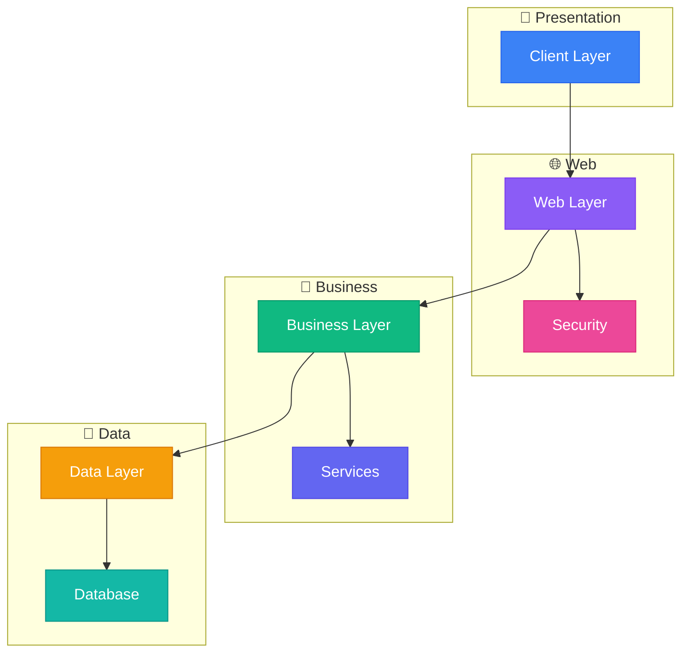
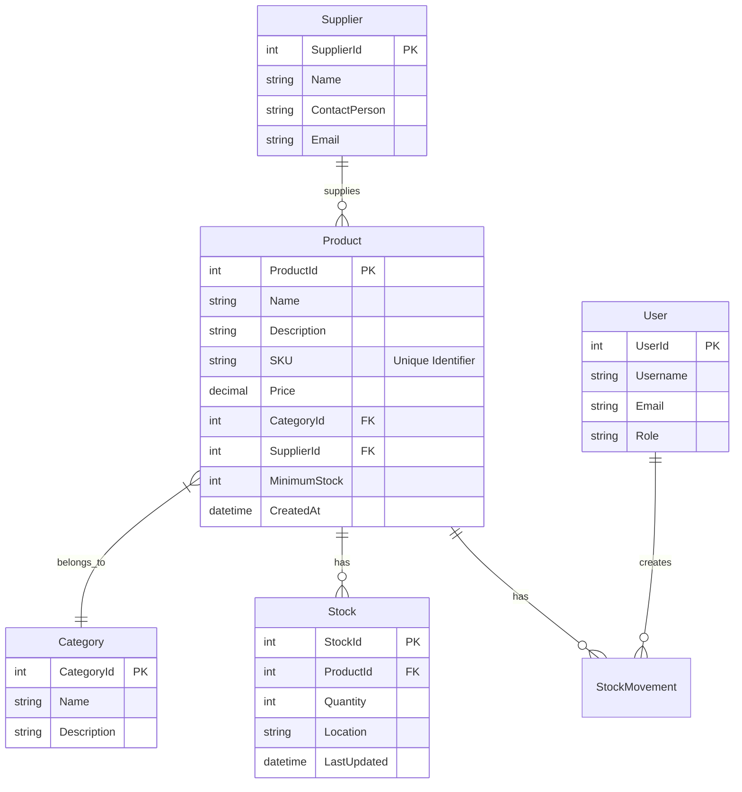
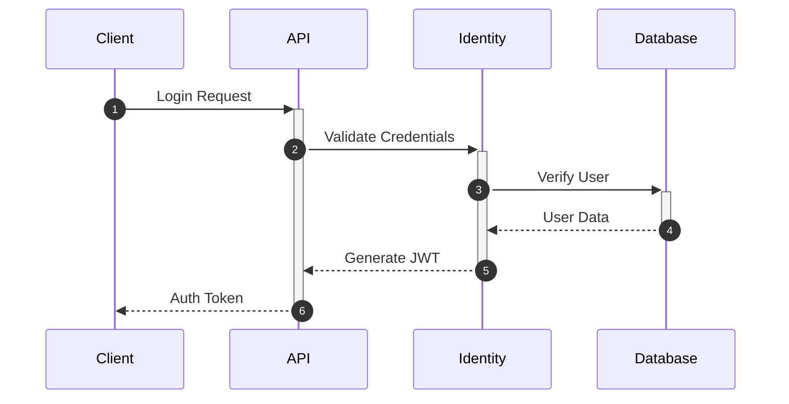

# 🏗️ System Design & Architecture

<div align="center">

[](docs/SystemDesign.md)
[](CHANGELOG.md)
[](docs/SystemDesign.md)

[](https://skillicons.dev)


### Clean Architecture Overview

```mermaid
graph TD
    A[Client Layer] --> B[Web Layer]
    B --> C[Business Layer]
    C --> D[Data Layer]
    B --> E[Security]
    C --> F[Services]
    D --> G[Database]
    
    subgraph "📱 Presentation"
        A
    end
    
    subgraph "🌐 Web"
        B
        E
    end
    
    subgraph "💼 Business"
        C
        F
    end
    
    subgraph "💾 Data"
        D
        G
    end

    classDef client fill:#3B82F6,stroke:#2563EB,color:white
    classDef web fill:#8B5CF6,stroke:#7C3AED,color:white
    classDef business fill:#10B981,stroke:#059669,color:white
    classDef data fill:#F59E0B,stroke:#D97706,color:white
    classDef security fill:#EC4899,stroke:#DB2777,color:white
    classDef services fill:#6366F1,stroke:#4F46E5,color:white
    classDef database fill:#14B8A6,stroke:#0D9488,color:white

    class A client
    class B web
    class C business
    class D data
    class E security
    class F services
    class G database
```

</div>

### Solution Structure
```
📦 IMS Solution
 ┣ 📂 IMS.Web                # Presentation Layer
 ┃ ┣ 📂 Controllers          # MVC & API Controllers
 ┃ ┣ 📂 Views               # Razor Views
 ┃ ┣ 📂 ViewModels          # View Data Models
 ┃ ┗ 📂 wwwroot            # Static Files
 ┣ 📂 IMS.Core              # Business Layer
 ┃ ┣ 📂 Services           # Business Logic
 ┃ ┣ 📂 Interfaces         # Abstractions
 ┃ ┣ 📂 Models            # Domain Models
 ┃ ┗ 📂 DTOs              # Data Transfer Objects
 ┣ 📂 IMS.Infrastructure    # Data Layer
 ┃ ┣ 📂 Data              # Data Access
 ┃ ┣ 📂 Security          # Authentication/Authorization
 ┃ ┗ 📂 Logging           # Logging & Monitoring
 ┗ 📂 IMS.Tests            # Testing
   ┣ 📂 Unit              # Unit Tests
   ┗ 📂 Integration       # Integration Tests
```

### Technology Stack

<div align="center">

| Layer | Technology | Version | Purpose |
|:-----:|:----------:|:-------:|:--------|
| 🎯 **Frontend** | ASP.NET MVC + Bootstrap | 5.0 | User Interface |
| 🔧 **Backend** | ASP.NET Core | 8.0 | Application Server |
| 💾 **Database** | SQL Server | 2022 | Data Storage |
| 🔄 **ORM** | Entity Framework | 8.0 | Data Access |
| 🔐 **Security** | Identity | 8.0 | Authentication |
| 🧪 **Testing** | xUnit | Latest | Testing Framework |

</div>

## 💾 Database Design

### Entity Relationship Diagram

```mermaid
erDiagram
    %% Core Entities
    Product ||--o{ StockMovement : has
    Product ||--o{ Stock : has
    Product }|--|| Category : belongs_to
    Supplier ||--o{ Product : supplies
    User ||--o{ StockMovement : creates
    
    %% Product Entity
    Product {
        int ProductId PK
        string Name
        string Description
        string SKU "Unique Identifier"
        decimal Price
        int CategoryId FK
        int SupplierId FK
        int MinimumStock
        datetime CreatedAt
    }
    
    %% Stock Management
    Stock {
        int StockId PK
        int ProductId FK
        int Quantity
        string Location
        datetime LastUpdated
    }
    
    %% Product Classification
    Category {
        int CategoryId PK
        string Name
        string Description
    }
    
    %% Supplier Management
    Supplier {
        int SupplierId PK
        string Name
        string ContactPerson
        string Email
    }

    %% User Management
    User {
        int UserId PK
        string Username
        string Email
        string Role
    }
```

## 🔌 API Design

### RESTful Endpoints

<div align="center">

| Endpoint | Method | Description | Authentication |
|:---------|:------:|:------------|:--------------:|
| **Product Management** ||||
| `/api/products` | GET | List all products | Required |
| `/api/products` | POST | Create product | Required |
| `/api/products/{id}` | GET | Get product details | Required |
| `/api/products/{id}` | PUT | Update product | Required |
| `/api/products/{id}` | DELETE | Delete product | Required |
| **Stock Management** ||||
| `/api/stock` | GET | Get stock levels | Required |
| `/api/stock/adjust` | POST | Adjust stock | Required |
| `/api/stock/low` | GET | Get low stock items | Required |
| **Supplier Management** ||||
| `/api/suppliers` | GET | List suppliers | Required |
| `/api/suppliers` | POST | Add supplier | Required |
| `/api/suppliers/{id}/products` | GET | Get supplier products | Required |

</div>

### Authentication Flow

```mermaid
sequenceDiagram
    autonumber
    participant Client
    participant API
    participant Identity
    participant Database

    Client->>+API: Login Request
    API->>+Identity: Validate Credentials
    Identity->>+Database: Verify User
    Database-->>-Identity: User Data
    Identity-->>-API: Generate JWT
    API-->>-Client: Auth Token
```

## 🎨 Interface Design

### Application Layout
```
📱 IMS Interface
┣ 🔝 Header
┃ ┣ 🏢 Logo & Branding
┃ ┣ 📱 Main Navigation
┃ ┗ 👤 User Controls
┣ 📊 Dashboard
┃ ┣ 📈 Key Metrics
┃ ┣ 🔔 System Alerts
┃ ┗ ⚡ Quick Actions
┗ 📋 Main Content
  ┣ 📑 Data Tables
  ┣ 📝 Input Forms
  ┗ 📊 Analytics
```

### UI Components

<div align="center">

| Component | Purpose | Key Features | Access Level |
|:---------:|:--------|:-------------|:------------:|
| 📊 Dashboard | System Overview | KPIs, Alerts, Actions | All Users |
| 📦 Products | Inventory Management | Grid, Filters, CRUD | Managers |
| 📈 Stock | Stock Control | Levels, Adjustments | Staff |
| 📋 Reports | Data Analysis | Charts, Exports | Managers |

</div>

## 🔒 Security Architecture

### Security Implementation

<div align="center">

| Security Layer | Implementation | Purpose | Priority |
|:--------------|:---------------|:---------|:--------:|
| 🔐 Authentication | JWT + Identity | User Verification | High |
| 👥 Authorization | Role-based Access | Permission Control | High |
| 🛡️ Data Protection | TLS 1.3 | Secure Communication | High |
| 🚦 API Security | Rate Limiting | Abuse Prevention | Medium |
| 📝 Audit Logging | Activity Tracking | Change Management | Medium |

</div>
