# 🏗️ System Design & Architecture

<div align="center">

[](docs/SystemDesign.md)
[](CHANGELOG.md)
[](docs/SystemDesign.md)

[](https://skillicons.dev)

</div>

> **Documentation Structure**  
> • [Project Overview](ProjectOverview.md): Business value, feature visualizations, team information  
> • **System Design** (this file): Technical architecture, database design, security implementation  
> • [Project Structure](ProjectStructure.md): Code organization, component details, design patterns

## MVC Architecture Overview


### Technology Stack

<div align="center">

| Layer | Technology | Version | Purpose |
|:-----:|:----------:|:-------:|:--------|
| 🎯 **Frontend** | ASP.NET MVC + Bootstrap | 8.0 | User Interface |
| 🔧 **Backend** | ASP.NET Core | 8.0 | Application Server |
| 💾 **Database** | SQL Server | 2022 | Data Storage |
| 🔄 **ORM** | Entity Framework Core | 8.0 | Data Access |
| 🔐 **Security** | ASP.NET Core Identity | 8.0 | Authentication |
| 🧠 **Business Logic** | Repository Pattern + Services | - | Business Rules |
| 🗺️ **Mapping** | AutoMapper | Latest | Object Mapping |
| ✅ **Validation** | FluentValidation | Latest | Input Validation |

</div>

## 💾 Database Design

### Entity Relationship Diagram


## 🧠 Application Core

### Domain Models

> For detailed descriptions of core entities, functionality, and implementation, refer to the [Project Structure](ProjectStructure.md) document.

### Service Layer Architecture


### Key Services

| Service | Responsibility | Key Operations |
|:--------|:---------------|:---------------|
| **ProductService** | Product management | CRUD, search, stock level checks |
| **CategoryService** | Category management | CRUD, hierarchical organization |
| **SupplierService** | Supplier management | CRUD, product associations |
| **StockService** | Inventory operations | Stock adjustments, movement history |
| **NotificationService** | System alerts | Generate alerts, mark as read |
| **DashboardService** | Analytics & metrics | KPIs, summary statistics |
| **ReportService** | Business intelligence | Custom reports, data exports |
| **UserContextService** | Identity management | Current user, roles, permissions |

## 🌐 Presentation Layer

### Controllers & Views Structure

<div align="center">

| Controller | Primary Views | Key Features |
|:-----------|:--------------|:-------------|
| **HomeController** | Index, Privacy, Error | Landing page, error handling |
| **DashboardController** | Index | KPIs, analytics, overview |
| **ProductController** | Index, Create, Edit, Details | Product management |
| **CategoryController** | Index, Create, Edit | Category management |
| **StockController** | Index, Adjust, History | Inventory operations |
| **SuppliersController** | Index, Create, Edit, Details | Supplier management |
| **NotificationController** | Index, Details | Alert management |
| **ReportsController** | Index, StockReport, ActivityReport | Reporting & exports |

</div>

### Key View Components

- **Navigation**: Main menu and breadcrumbs
- **Notifications**: Real-time alerts display
- **StockLevel**: Visual indicators for stock status
- **UserInfo**: Current user display and options
- **SearchBox**: Global search functionality
- **CategoryTree**: Hierarchical category display
- **RecentActivity**: Latest system activities

## 🔒 Security Architecture

### Authentication & Authorization
The system uses ASP.NET Core Identity for authentication with the following components:


### Security Implementation

<div align="center">

| Security Layer | Implementation | Purpose |
|:--------------|:---------------|:---------|
| 🔐 Authentication | ASP.NET Core Identity | User verification |
| 👥 Authorization | Role-based access control | Permission management |
| 🛡️ Data Protection | Input validation | Prevent XSS/injection |
| 🔍 Audit Logging | Activity tracking | Change history |
| 🚦 Request Pipeline | Security middleware | Headers, error handling |

</div>

### Role-Based Access Control

| Role | Permissions | Access Areas |
|:-----|:------------|:-------------|
| **Administrator** | Full system access | All areas |
| **Manager** | Read/write most data | Products, reports, suppliers |
| **Staff** | Limited write access | Basic inventory operations |
| **Viewer** | Read-only access | Dashboards and basic views |

## 🔄 Data Access Layer

### Repository Pattern Implementation


### Database Connection Configuration

```json
{
  "DatabaseConfig": {
    "ConnectionString": "Server=...;Database=InventoryManagementSystem;Trusted_Connection=True;MultipleActiveResultSets=true;TrustServerCertificate=True",
    "CommandTimeout": 30,
    "EnableDetailedErrors": false,
    "EnableSensitiveDataLogging": false,
    "EnableAutoMigration": true,
    "MaxRetryCount": 3,
    "MaxRetryDelay": 5
  }
}
```

### Unit of Work Pattern

```csharp
public interface IUnitOfWork : IDisposable
{
    IProductRepository Products { get; }
    ICategoryRepository Categories { get; }
    ISupplierRepository Suppliers { get; }
    IProductSupplierRepository ProductSuppliers { get; }
    IStockHistoryRepository StockHistory { get; }
    INotificationRepository Notifications { get; }
    
    Task<int> CompleteAsync();
}
```

## 📊 User Interface Design

### UI Components

<div align="center">

| Page | Key Components | Features |
|:-----|:--------------|:---------|
| **Dashboard** | Cards, Charts, Alerts | Overview, KPIs |
| **Products** | DataTable, Forms, Modals | CRUD operations |
| **Stock** | Forms, History Table | Adjustments, tracking |
| **Suppliers** | DataTable, Forms | Supplier management |
| **Reports** | Charts, Tables, Export | Data analysis |

</div>

### Dashboard Preview

```mermaid
classDiagram
    class DashboardUI {
        +header: NavigationBar
        +content: MainContent
        +footer: AppFooter
    }
    
    class NavigationBar {
        +logo: String
        +mainMenu: MenuItem[]
        +userProfile: UserWidget
        +notifications: NotificationBadge
        +render()
        +handleNavigation(route)
    }
    
    class MainContent {
        +statsPanel: StatsPanel
        +chartsPanel: ChartsPanel
        +notificationsPanel: NotificationsPanel
        +render()
        +refreshData()
    }
    
    class StatsPanel {
        +totalProducts: KpiCard
        +lowStockItems: KpiCard
        +outOfStockItems: KpiCard
        +recentActivity: KpiCard
        +render()
    }
    
    class ChartsPanel {
        +stockMovementChart: LineChart
        +categoryDistribution: PieChart
        +render()
        +exportChart(format)
    }
    
    class NotificationsPanel {
        +notifications: NotificationItem[]
        +filterByType(type)
        +markAsRead(id)
        +render()
    }
    
    class KpiCard {
        +title: String
        +value: Number
        +icon: String
        +trend: Number
        +colorScheme: String
        +render()
    }
    
    class NotificationItem {
        +id: Number
        +title: String
        +message: String
        +type: String
        +isRead: Boolean
        +createdAt: DateTime
        +render()
    }
    
    DashboardUI *-- NavigationBar
    DashboardUI *-- MainContent
    MainContent *-- StatsPanel
    MainContent *-- ChartsPanel
    MainContent *-- NotificationsPanel
    StatsPanel *-- KpiCard
    NotificationsPanel *-- NotificationItem
    
    note for DashboardUI "Modern responsive dashboard layout with flexbox grid system"
    note for StatsPanel "📊 Key metrics: 1,234 products, 42 low stock, 12 out of stock"
    note for ChartsPanel "📈 Interactive charts with data filtering and export options"
    note for NotificationsPanel "🔔 Real-time notifications with read/unread status"
```


### Responsive Design Strategy
The application uses Bootstrap with custom components to ensure responsive behavior across devices:
- Fluid layouts that adapt to screen size
- Mobile-first approach for all pages
- Collapsible navigation on smaller screens
- Responsive tables with horizontal scrolling
- Touch-friendly inputs and controls
